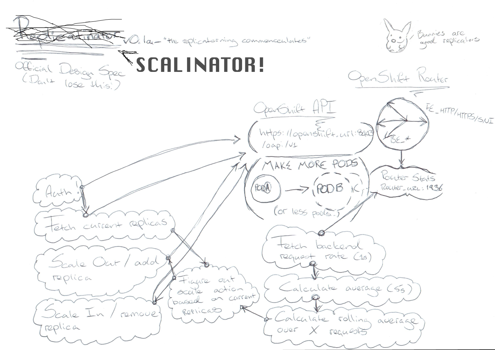

#  Scalinator

A pod autoscaler which uses Red Hat OpenShift's router metrics to make scale decisions.

### Develop/Build

python setup.py develop | build

### Usage

Coming soon!

### Author
Julian Gericke
###### LSD Information Technology
###### julian@lsd.co.za 
2017
 
